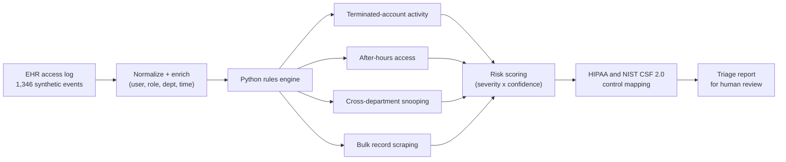

# PHI Access Anomaly Detection

**Python-based detection engineering for EHR audit logs — find the insider threat hiding in 1,300+ access events.**

## Overview

Healthcare's most common breach isn't a sophisticated hack — it's an employee looking at records they shouldn't, or an account that should have been disabled and wasn't. Both leave traces in the EHR access log, if anyone is looking.

This project builds a rules-based detection pipeline over a synthetic EHR access log (1,346 events, 8 users, 10 business days) with **four realistic attack/misuse patterns planted in the noise**:

| Planted pattern | Detected by | Severity |
|---|---|---|
| Terminated employee's account still accessing labs | R3 | CRITICAL |
| Brute-force login burst followed by a success | R4 | CRITICAL |
| Registration clerk scraping 85 charts in an hour | R2 (3σ statistical baseline) | HIGH |
| Billing specialist viewing charts at 3 AM | R1 | HIGH |

The detector finds **all four with zero false positives**, then writes a severity-ranked [alerts.csv](output/alerts.csv) and an analyst-style [incident report](output/incident_report.md) with containment recommendations per finding.

> All identities, patients, and events are synthetic and reproducible (seeded RNG). No PHI.

## Why it's built this way

Every rule maps to a specific HIPAA Security Rule citation and NIST CSF 2.0 control — documented in [docs/detection_playbook.md](docs/detection_playbook.md). That mapping matters: in a covered entity, "we monitor logs" isn't a control until you can say *which requirement each detection satisfies*. The volume rule (R2) uses a statistical baseline (mean + 3σ) rather than a hard-coded threshold, so it adapts to real staffing patterns.

## Architecture



Detections are deliberately rules-based rather than ML: in a compliance context every alert
has to be explainable to an auditor, and a rule states its own reasoning.

## Privacy and security guardrails

- **Synthetic data only.** All 1,346 access events, users, and patient identifiers are
  generated. No real PHI, patient records, or production logs are used anywhere.
- **No third-party data egress.** The pipeline runs entirely locally on local files. No
  cloud service, API, or LLM ever sees the data.
- **Minimum necessary.** Detection logic reads only the fields required to evaluate a rule
  (user, role, department, timestamp, record ID) rather than clinical note content.
- **Explainable alerts.** Each finding records the rule that fired and the evidence behind
  it, so a reviewer can confirm or dismiss it without rerunning the pipeline.
- **Human review, not enforcement.** Output is a triage queue. Nothing is auto-escalated or
  auto-disabled, which reflects how real insider-threat review actually works.

## Repository structure

```
phi-access-anomaly-detection/
├── data/access_logs.csv        # Synthetic EHR audit log (generated)
├── src/
│   ├── generate_logs.py        # Seeded log generator with planted patterns
│   └── detect_anomalies.py     # 4-rule detection engine
├── output/
│   ├── alerts.csv              # Severity-ranked findings
│   └── incident_report.md      # Analyst report with response actions
└── docs/detection_playbook.md  # Rule rationale + HIPAA / NIST CSF mapping
```

## How to run

```bash
pip install pandas
python src/generate_logs.py       # build the synthetic audit log
python src/detect_anomalies.py    # run detections, write alerts + report
```

## Skills demonstrated

Detection engineering (rule design, severity modeling, false-positive control) · security log analysis with Python/pandas · statistical anomaly detection · HIPAA Security Rule & NIST CSF 2.0 control mapping · incident response documentation

## About

Part of my healthcare analytics & security portfolio — applying the Google Cybersecurity certificate to the healthcare compliance domain I work in.

📫 elazarferrer1@gmail.com · [Profile](https://github.com/elazarf123)
